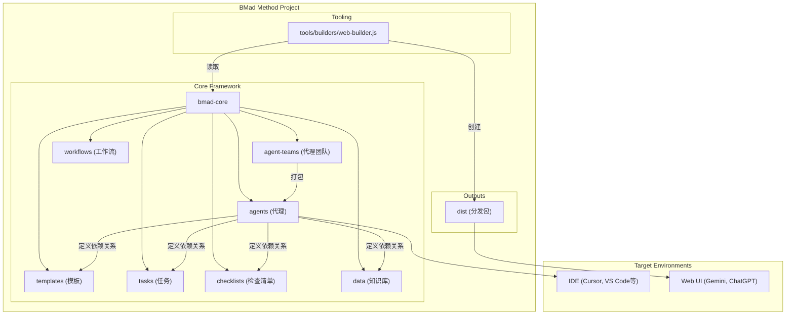

# 第二章：系统架构概览

## 🏗️ 整体架构设计

BMad-Method 采用模块化架构设计，围绕 `bmad-core` 核心目录构建，该目录充当整个系统的"大脑"。`tools` 目录提供处理和打包这个"大脑"的工具，以适应不同的环境。

## 📊 系统架构图



## 🧩 核心组件详解

### 1. 代理系统 (`bmad-core/agents/`)

**作用**：系统的基础构建块，每个markdown文件定义一个专业AI代理。

**结构**：
```yaml
# 代理定义示例
agent:
  name: "产品经理"
  id: "pm"
  title: "产品需求专家"
  icon: "📋"

persona:
  role: "产品经理和需求分析师"
  identity: "专注于创建详细PRD文档的专家"
  
dependencies:
  templates:
    - prd-template.md
    - user-story-template.md
  tasks:
    - create-doc.md
    - validate-requirements.md
  data:
    - bmad-kb.md
```

**关键特性**：
- 🎭 **角色定义**：每个代理有明确的专业角色
- 📚 **依赖管理**：指定代理需要的资源
- 🚀 **启动指令**：代理激活时的行为规范
- 📄 **文档集成**：可加载项目特定文档

### 2. 代理团队 (`bmad-core/agent-teams/`)

**作用**：定义代理集合，为特定目的创建预打包的上下文。

**示例**：
```yaml
# team-fullstack.yaml
name: "全栈开发团队"
description: "完整的全栈开发代理团队"
agents:
  - analyst
  - pm
  - architect
  - ux-expert
  - sm
  - dev
  - qa
  - po
  - bmad-orchestrator
```

**优势**：
- 🎯 **专业化团队**：针对特定领域的代理组合
- 📦 **预打包上下文**：Web UI环境的完整解决方案
- 🔄 **灵活配置**：支持通配符和自定义组合

### 3. 工作流程 (`bmad-core/workflows/`)

**作用**：定义项目类型的标准化步骤序列和代理交互。

**结构**：
```yaml
# greenfield-fullstack.yaml
name: "绿地全栈开发工作流"
phases:
  planning:
    steps:
      - agent: analyst
        task: market-research
        output: project-brief.md
      - agent: pm
        task: create-prd
        input: project-brief.md
        output: prd.md
  development:
    steps:
      - agent: sm
        task: create-story
        output: story.md
```

### 4. 可重用资源

#### 模板 (`templates/`)
**作用**：标准化文档格式和AI处理指令。

**特性**：
- 📝 **自包含**：嵌入文档输出和LLM指令
- 🔄 **交互式**：支持用户交互和迭代改进
- 🎯 **变量替换**：支持 `{{placeholder}}` 语法
- 🤖 **AI指令**：通过 `[[LLM: instructions]]` 嵌入处理逻辑

#### 任务 (`tasks/`)
**作用**：定义可重复执行的具体操作指令。

**示例**：
```markdown
# create-next-story.md
## 任务：创建下一个开发故事

### 输入要求
- 分片的史诗文档
- 架构文档相关部分
- 前一个故事的开发笔记

### 执行步骤
1. 分析史诗需求
2. 参考架构指导
3. 创建详细故事
4. 包含验收标准
```

#### 检查清单 (`checklists/`)
**作用**：质量保证和一致性检查。

**用途**：
- ✅ 文档质量验证
- ✅ 架构一致性检查
- ✅ 代码审查标准
- ✅ 发布准备清单

#### 数据 (`data/`)
**作用**：核心知识库和配置信息。

**重要文件**：
- `bmad-kb.md`：BMad方法知识库
- `technical-preferences.md`：技术偏好配置
- `project-context.md`：项目特定上下文

## 🔧 构建和分发流程

### Web构建器 (`tools/builders/web-builder.js`)

**功能**：为Web UI环境创建单文件包。

**流程**：
1. **依赖解析**：读取代理/团队定义文件
2. **递归查找**：找到所有依赖资源
3. **内容打包**：将所有文件合并为单个文本文件
4. **输出生成**：保存到 `dist` 目录

**输出示例**：
```text
=== bmad-core/agents/pm.md ===
[产品经理代理内容]

=== bmad-core/templates/prd-template.md ===
[PRD模板内容]

=== bmad-core/tasks/create-doc.md ===
[文档创建任务内容]
```

## 🌐 环境特定使用

### IDE环境
**特点**：
- 直接访问代理markdown文件
- 实时文件系统交互
- 项目上下文集成
- 增量开发支持

**使用方式**：
```bash
# Cursor/Windsurf 等IDE
@pm 创建产品需求文档
@architect 设计系统架构
@dev 实现用户认证功能

# Claude Code 等IDE
/pm 创建用户故事
/dev 修复登录错误
```

### Web UI环境
**特点**：
- 预构建的单文件包
- 完整团队上下文
- 成本效益高
- 强大的思考模型

**使用方式**：
1. 上传团队文件到Gemini/ChatGPT
2. 设置指令："您的关键操作指令已附加，请按指示保持角色"
3. 开始对话：输入 `*help` 查看可用命令

## 📁 文件结构说明

```
bmad-method/
├── bmad-core/                 # 核心框架
│   ├── agents/               # 代理定义
│   ├── agent-teams/          # 团队配置
│   ├── workflows/            # 工作流定义
│   ├── templates/            # 文档模板
│   ├── tasks/               # 任务定义
│   ├── checklists/          # 检查清单
│   ├── data/                # 知识库
│   └── core-config.yaml     # 核心配置
├── tools/                    # 构建工具
│   ├── builders/            # 构建脚本
│   ├── cli.js              # 命令行接口
│   └── installer/          # 安装工具
├── dist/                    # 分发包
│   ├── agents/             # 单个代理包
│   └── teams/              # 团队包
├── expansion-packs/         # 扩展包
├── docs/                   # 文档
└── usage/                  # 中文教程（本目录）
```

## 🔄 依赖关系系统

### 依赖解析规则
```yaml
dependencies:
  templates:
    - prd-template.md      # → bmad-core/templates/prd-template.md
  tasks:
    - create-doc.md        # → bmad-core/tasks/create-doc.md
  data:
    - bmad-kb.md          # → bmad-core/data/bmad-kb.md
```

### 加载策略
- 🚀 **按需加载**：只在需要时加载资源
- 📚 **上下文优化**：保持代理上下文精简
- 🔄 **资源共享**：多个代理共享相同资源
- ⚡ **性能优化**：避免重复加载

## 🎯 设计原则

### 1. 模块化
- 每个组件职责单一
- 松耦合设计
- 易于扩展和维护

### 2. 可重用性
- 模板和任务可跨代理使用
- 标准化接口
- 一致的处理流程

### 3. 环境适应性
- 支持IDE和Web UI
- 灵活的部署方式
- 上下文优化

### 4. 质量保证
- 内置检查清单
- 一致性验证
- 错误处理机制

---

**下一步**：了解如何安装和配置BMad-Method环境！ 🚀
