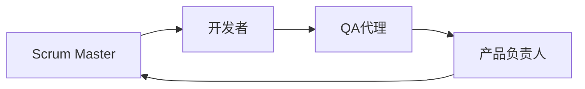

# 第四章：AI代理系统

## 🤖 代理系统概述

BMad-Method的核心是一个专业化的AI代理生态系统。每个代理都是特定领域的专家，具有明确的角色、职责和专业知识。这种设计确保了高质量的输出和一致的工作流程。

## 🎭 核心代理角色

### 规划阶段代理

#### 🔍 分析师 (Analyst)
**角色**：市场研究和项目分析专家

**核心职责**：
- 📊 市场研究和趋势分析
- 🏢 竞争对手分析
- 📋 项目简介创建
- 💡 创意头脑风暴
- 📈 可行性评估

**典型输出**：
- 项目简介文档
- 市场研究报告
- 竞争分析报告
- 用户画像定义

**使用场景**：
```bash
# IDE中使用
@analyst 为我的电商项目进行市场研究
@analyst 分析竞争对手的优势和劣势

# Web UI中使用
*analyst
# 然后描述您的项目想法
```

#### 📋 产品经理 (PM)
**角色**：产品需求和规划专家

**核心职责**：
- 📝 创建详细的PRD文档
- 🎯 定义功能需求和非功能需求
- 📚 史诗和用户故事管理
- 🔄 需求优先级排序
- ✅ 验收标准定义

**典型输出**：
- 产品需求文档(PRD)
- 用户故事集合
- 功能规格说明
- 验收标准清单

**使用场景**：
```bash
@pm 基于项目简介创建PRD文档
@pm 为用户认证功能创建详细需求
```

#### 🏗️ 架构师 (Architect)
**角色**：系统架构和技术设计专家

**核心职责**：
- 🏛️ 系统架构设计
- 🔧 技术栈选择和评估
- 📐 设计模式推荐
- 🔗 集成方案设计
- 📊 性能和扩展性规划

**典型输出**：
- 系统架构文档
- 技术栈规范
- 数据库设计
- API设计规范
- 部署架构图

**使用场景**：
```bash
@architect 基于PRD设计系统架构
@architect 推荐适合的技术栈
```

#### 🎨 UX专家 (UX Expert)
**角色**：用户体验和界面设计专家

**核心职责**：
- 🖼️ 用户界面设计规范
- 🔄 用户体验流程设计
- 📱 交互设计模式
- 🎯 可用性标准定义
- 🎨 视觉设计指导

**典型输出**：
- UX设计规范
- 用户流程图
- 界面原型描述
- 交互设计指南
- 可用性检查清单

### 开发阶段代理

#### 📊 Scrum Master (SM)
**角色**：敏捷开发流程管理专家

**核心职责**：
- 📝 从史诗创建详细开发故事
- 🎯 任务分解和优先级管理
- 📋 开发计划制定
- 🔄 迭代管理和进度跟踪
- 🤝 团队协调和沟通

**典型输出**：
- 详细开发故事
- 任务分解清单
- 迭代计划
- 进度报告
- 风险识别

**使用场景**：
```bash
@sm 从用户认证史诗创建下一个开发故事
@sm 分析当前进度并规划下一步
```

#### 💻 开发者 (Dev)
**角色**：代码实现和技术实施专家

**核心职责**：
- 💾 功能代码实现
- 🧪 单元测试编写
- 🔧 技术债务管理
- 📚 代码文档编写
- 🐛 错误修复和调试

**典型输出**：
- 功能实现代码
- 单元测试套件
- 技术文档
- 代码审查报告
- 重构建议

**使用场景**：
```bash
@dev 实现用户登录功能
@dev 为购物车功能编写测试
@dev 修复支付流程中的错误
```

#### 🔍 QA测试架构师 (QA)
**角色**：质量保证和测试策略专家

**核心职责**：
- 🎯 风险评估和分析
- 🧪 测试策略设计
- 📊 需求追踪和覆盖
- ⚡ 非功能性需求验证
- 🚪 质量门控管理

**核心命令**：
```bash
@qa *risk {story}     # 风险评估
@qa *design {story}   # 测试设计
@qa *trace {story}    # 需求追踪
@qa *nfr {story}      # 非功能性需求评估
@qa *review {story}   # 综合审查
@qa *gate {story}     # 质量门控
```

**典型输出**：
- 风险评估报告
- 测试策略文档
- 需求追踪矩阵
- 质量门控决策
- 测试改进建议

#### 👥 产品负责人 (PO)
**角色**：产品质量和一致性管理专家

**核心职责**：
- 📄 文档分片和组织
- ✅ 需求验证和确认
- 🔍 质量检查和审核
- 📊 项目进度监控
- 🎯 优先级调整

**典型输出**：
- 分片的史诗文档
- 分片的架构文档
- 质量检查报告
- 需求验证结果
- 项目状态报告

### 特殊代理

#### 🧙 BMad-Master
**角色**：万能任务执行器

**特点**：
- 🎯 可执行所有其他代理的任务
- 📚 无需角色转换，直接运行资源
- 🔄 适合一次性任务和多样化需求
- 💡 包含BMad方法的完整知识

**使用场景**：
- 不确定使用哪个专业代理时
- 需要快速执行多种不同任务
- 学习和探索BMad功能
- 一次性或临时任务

**命令示例**：
```bash
@bmad-master *help           # 查看所有可用命令
@bmad-master *create         # 创建文档
@bmad-master *kb            # 访问知识库
```

#### 🎭 BMad-Orchestrator
**角色**：Web平台协调器（仅限Web UI）

**特点**：
- 🌐 专为Web UI环境设计
- 🎯 引导完整的BMad工作流程
- 🤝 协调多个代理协作
- 📋 提供流程指导和建议

**注意**：此代理不应在IDE中使用，它是重量级的特殊用途代理。

## 🔗 代理依赖系统

### 依赖类型

每个代理都定义了其所需的资源依赖：

```yaml
dependencies:
  templates:          # 文档模板
    - prd-template.md
    - story-template.md
  tasks:             # 可执行任务
    - create-doc.md
    - validate-requirements.md
  checklists:        # 质量检查清单
    - prd-checklist.md
    - architecture-checklist.md
  data:              # 知识库和配置
    - bmad-kb.md
    - technical-preferences.md
```

### 加载策略

**关键原则**：
- 🚀 **按需加载**：只在执行特定任务时加载资源
- 📚 **精简上下文**：代理只加载必需的资源
- 🔄 **资源共享**：多个代理可共享相同资源
- ⚡ **性能优化**：避免重复加载和上下文膨胀

### 依赖解析

```text
模板依赖：prd-template.md → bmad-core/templates/prd-template.md
任务依赖：create-doc.md → bmad-core/tasks/create-doc.md
数据依赖：bmad-kb.md → bmad-core/data/bmad-kb.md
```

## 🎯 代理交互模式

### IDE环境交互

**Cursor/Windsurf风格**：
```bash
@pm 创建产品需求文档
@architect 设计微服务架构
@dev 实现用户认证API
@qa *review user-auth-story
```

**Claude Code风格**：
```bash
/pm 创建用户故事
/dev 修复登录错误
/qa 进行代码审查
```

### Web UI交互

**命令格式**：
```bash
*help                    # 查看可用命令
*analyst                # 切换到分析师代理
*pm                     # 切换到产品经理代理
*architect              # 切换到架构师代理
```

**工作流程**：
1. 输入 `*help` 查看选项
2. 选择适当的代理
3. 描述您的需求
4. 跟随代理的引导
5. 迭代改进输出

## 🔄 代理协作流程

### 规划阶段协作


1. **分析师**创建项目简介
2. **产品经理**基于简介创建PRD
3. **架构师**基于PRD设计架构
4. **UX专家**设计用户体验
5. **产品负责人**验证文档一致性

### 开发阶段协作



1. **Scrum Master**创建开发故事
2. **开发者**实现功能和测试
3. **QA代理**进行质量审查
4. **产品负责人**验证完成
5. 循环进行下一个故事

## 💡 最佳实践

### 代理选择策略

- 🎯 **明确目标**：根据具体任务选择合适的代理
- 📚 **上下文管理**：保持相关文件在上下文中
- 🔄 **迭代改进**：使用代理反馈改进输出
- 📋 **文档组织**：维护清晰的项目结构

### 交互技巧

- 📝 **清晰描述**：提供详细的需求描述
- 🎯 **具体指令**：使用具体的命令和参数
- 🔄 **迭代对话**：通过多轮对话完善结果
- 📊 **验证输出**：检查代理输出的质量和完整性

### 常见错误避免

- ❌ **不要**在启动时预加载所有资源
- ❌ **不要**混合使用不同代理的职责
- ❌ **不要**跳过质量检查步骤
- ❌ **不要**忽略代理的专业建议

---

**下一步**：深入了解BMad的工作流程详解！ 🔄
