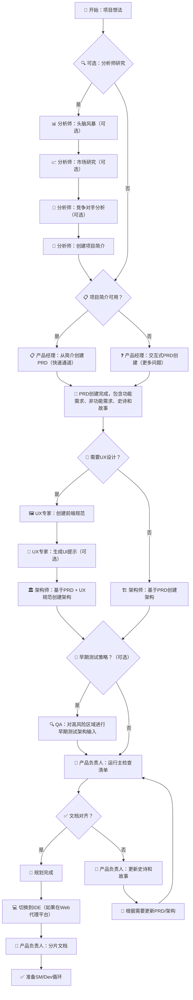
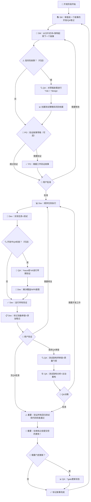

# 第五章：工作流程详解

## 🔄 BMad-Method 完整工作流程

BMad-Method 采用两阶段工作流程：**规划阶段**（推荐在Web UI进行）和**开发阶段**（在IDE中进行）。这种设计确保了成本效益和开发效率的最佳平衡。

## 📋 规划工作流程（Web UI推荐）

### 为什么选择Web UI进行规划？

- 💰 **成本效益**：利用平台提供的强大模型，无需自己的API密钥
- 🧠 **大上下文**：支持更大的上下文窗口，适合复杂规划
- 🤝 **协作友好**：易于团队分享和讨论
- 💡 **强大思考**：访问最新的推理模型

### 规划阶段流程图



### 详细步骤说明

#### 第一步：项目构思和分析
```bash
# Web UI中开始
*help                    # 查看可用命令
*analyst                 # 激活分析师代理

# 描述您的项目想法
"我想创建一个在线学习平台，帮助学生更好地学习编程"
```

**分析师会帮助您**：
- 🎯 明确项目目标和愿景
- 📊 进行市场研究和趋势分析
- 🏢 分析竞争对手优劣势
- 👥 定义目标用户群体
- 📋 创建详细的项目简介

#### 第二步：产品需求定义
```bash
*pm                      # 切换到产品经理代理
# 基于项目简介创建PRD
```

**产品经理会创建**：
- 📝 详细的产品需求文档(PRD)
- 🎯 功能需求(FR)和非功能需求(NFR)
- 📚 史诗(Epics)和用户故事(User Stories)
- ✅ 验收标准和成功指标
- 🔄 优先级排序和发布计划

#### 第三步：系统架构设计
```bash
*architect               # 切换到架构师代理
# 基于PRD设计系统架构
```

**架构师会设计**：
- 🏛️ 系统整体架构
- 🔧 技术栈选择和评估
- 📊 数据库设计和数据流
- 🔗 API设计和集成方案
- 📈 性能和扩展性考虑

#### 第四步：用户体验设计（可选）
```bash
*ux-expert               # 切换到UX专家
# 创建用户体验规范
```

**UX专家会提供**：
- 🖼️ 用户界面设计规范
- 🔄 用户体验流程图
- 📱 交互设计模式
- 🎨 视觉设计指导
- 🎯 可用性标准

#### 第五步：质量检查和对齐
```bash
*po                      # 切换到产品负责人
# 运行主检查清单
```

**产品负责人会验证**：
- ✅ 文档完整性和一致性
- 🔗 需求和架构的对齐
- 📊 史诗和故事的合理性
- 🎯 验收标准的清晰度
- 📋 项目可行性评估

## 💻 开发工作流程（IDE环境）

### 为什么切换到IDE？

- 🔧 **文件系统访问**：直接操作项目文件
- 💾 **代码实现**：实际编写和测试代码
- 🔄 **版本控制**：Git集成和变更管理
- 🚀 **开发工具**：调试、测试、部署工具

### 关键转换点

**从Web UI到IDE的转换**：
1. 📄 **复制文档**：确保 `docs/prd.md` 和 `docs/architecture.md` 在项目中
2. 💻 **打开IDE**：在您首选的代理IDE中打开项目
3. 📂 **文档分片**：使用PO代理分片PRD和架构文档
4. 🚀 **开始开发**：启动核心开发循环

### 开发阶段流程图



### 详细开发步骤

#### 第一步：文档分片
```bash
# 在IDE中
@po 分片PRD文档到史诗
@po 分片架构文档
```

**产品负责人会创建**：
- 📂 `docs/epics/` - 分片的史诗文档
- 📂 `docs/stories/` - 故事模板和结构
- 🏗️ 架构组件的分片文档

#### 第二步：故事创建和开发
```bash
@sm 从用户认证史诗创建下一个开发故事
```

**Scrum Master会创建**：
- 📝 详细的开发故事
- 🎯 具体的任务分解
- 📋 验收标准
- 🔗 架构指导链接
- ⏰ 估算和优先级

#### 第三步：代码实现
```bash
@dev 实现用户登录功能
@dev 为登录功能编写测试
```

**开发者会提供**：
- 💾 功能实现代码
- 🧪 单元测试和集成测试
- 📚 代码文档
- 🔧 错误处理和边界情况
- 📊 性能考虑

#### 第四步：质量保证（可选但推荐）
```bash
@qa *review user-login-story
```

**QA代理会进行**：
- 🔍 代码质量审查
- 🧪 测试覆盖率分析
- ⚡ 性能和安全检查
- 📊 需求追踪验证
- 🚪 质量门控决策

## 🎯 工作流程最佳实践

### 规划阶段最佳实践

1. **充分利用分析师**：
   - 📊 进行彻底的市场研究
   - 🏢 分析竞争对手
   - 👥 明确目标用户

2. **详细的PRD创建**：
   - 📝 包含所有功能和非功能需求
   - 🎯 明确验收标准
   - 📋 合理的史诗和故事分解

3. **架构设计考虑**：
   - 🏗️ 考虑未来扩展性
   - 🔧 选择合适的技术栈
   - 📊 设计清晰的数据流

### 开发阶段最佳实践

1. **故事管理**：
   - 📝 保持故事小而专注
   - 🎯 包含完整的上下文
   - 📋 明确的验收标准

2. **代码质量**：
   - 🧪 编写充分的测试
   - 📚 维护清晰的文档
   - 🔧 遵循编码标准

3. **质量保证**：
   - 🔍 定期进行代码审查
   - 📊 监控测试覆盖率
   - ⚡ 关注性能和安全

### 常见陷阱避免

- ❌ **不要跳过规划阶段**：充分的规划节省开发时间
- ❌ **不要忽略文档分片**：分片确保开发上下文完整
- ❌ **不要跳过质量检查**：QA审查提高代码质量
- ❌ **不要忘记提交代码**：定期提交保护您的工作

---

**下一步**：学习模板和任务系统的工作原理！ 📋
