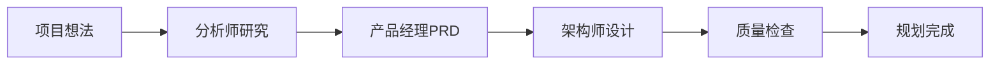
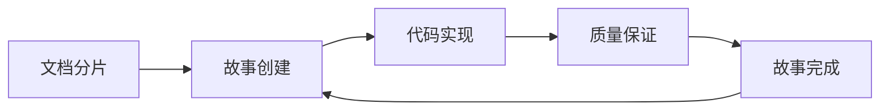

# BMad-Method 中文教程

欢迎来到 BMad-Method（突破性敏捷AI驱动开发方法）的中文学习资源！

## 📚 教程概述

本教程将原版英文文档转化为详细的中文指南，帮助中文用户更好地理解和使用这个强大的AI代理框架。

### 🎯 什么是 BMad-Method？

BMad-Method 是一个通用的AI代理框架，专为敏捷AI驱动开发而设计。它通过两大核心创新解决了AI辅助开发中的关键问题：

1. **🤝 代理规划**：专业化AI代理（分析师、产品经理、架构师）协作创建详细、一致的项目文档
2. **🎯 上下文工程开发**：将详细计划转换为包含完整上下文的开发故事，消除上下文丢失问题

## 📖 教程结构

### 🚀 快速入门
- **[中文教程大纲](中文教程大纲.md)** - 完整学习路径规划
- **[快速开始指南](06-快速开始指南.md)** - 2分钟快速体验BMad-Method

### 📚 基础教程
1. **[BMad-Method简介](01-BMad-Method简介.md)**
   - 核心概念和创新点
   - 与传统方法的区别
   - 适用场景和优势

2. **[系统架构概览](02-系统架构概览.md)**
   - 整体架构设计
   - 核心组件详解
   - 构建和分发流程

3. **[环境准备与安装](03-环境准备与安装.md)**
   - 系统要求和依赖
   - 详细安装步骤
   - 常见问题解决

4. **[AI代理系统](04-AI代理系统.md)**
   - 代理角色和职责
   - 依赖系统和交互模式
   - 最佳实践指南

5. **[工作流程详解](05-工作流程详解.md)**
   - 规划阶段流程（Web UI）
   - 开发阶段流程（IDE）
   - 阶段转换和最佳实践

## 🎭 核心代理介绍

### 规划阶段代理
- **🔍 分析师（Analyst）**：市场研究、竞争分析、项目简介创建
- **📋 产品经理（PM）**：PRD文档创建、需求管理、史诗故事定义
- **🏗️ 架构师（Architect）**：系统架构设计、技术选型、设计模式
- **🎨 UX专家（UX Expert）**：用户体验设计、界面规范、交互设计

### 开发阶段代理
- **📊 Scrum Master（SM）**：故事创建、任务分解、进度管理
- **💻 开发者（Dev）**：代码实施、测试编写、功能实现
- **🔍 QA测试架构师（QA）**：质量保证、测试策略、风险评估
- **👥 产品负责人（PO）**：需求验证、文档分片、质量检查

### 特殊代理
- **🧙 BMad-Master**：万能代理，可执行所有任务
- **🎭 BMad-Orchestrator**：Web平台协调器，引导整个流程

## 🚀 快速开始

### 方式一：Web UI（推荐新手）
```bash
# 1. 获取团队文件
下载 dist/teams/team-fullstack.txt

# 2. 创建AI代理（选择一个平台）
- Gemini Gem
- ChatGPT CustomGPT  
- Claude 对话

# 3. 上传文件并设置指令
"您的关键操作指令已附加，请按指示保持角色"

# 4. 开始使用
*help                    # 查看可用命令
*analyst                 # 开始项目分析
```

### 方式二：IDE本地安装
```bash
# 1. 安装BMad-Method
npx bmad-method install

# 2. 在IDE中使用
@pm 创建产品需求文档
@architect 设计系统架构
@dev 实现用户认证功能
```

## 🔄 典型工作流程

### 规划阶段（Web UI推荐）


### 开发阶段（IDE环境）


## 💡 核心优势

### 🎯 解决关键问题
- **规划不一致**：专业代理确保文档质量和一致性
- **上下文丢失**：故事文件包含完整实施上下文
- **质量控制**：内置QA流程和质量门控

### 🚀 提升开发效率
- **结构化流程**：标准化的开发工作流程
- **专业分工**：每个代理专注于特定领域
- **自动化质量**：内置测试和审查机制

### 🌍 通用适用性
- **软件开发**：全栈应用、API、移动应用
- **非技术领域**：创意写作、商业策略、教育、健康

## 🛠 支持的环境

### IDE环境
- ✅ **Cursor**：使用 `@agent` 语法
- ✅ **VS Code**：配合AI扩展使用
- ✅ **Windsurf**：原生AI代理支持
- ✅ **Claude Code**：使用 `/agent` 语法

### Web UI平台
- ✅ **Gemini**：创建Gem并上传团队文件
- ✅ **ChatGPT**：创建CustomGPT
- ✅ **Claude**：直接对话上传文件

## 📦 扩展包系统

BMad-Method 支持扩展到任何领域：

### 技术类扩展包
- 🎮 游戏开发包
- 📱 移动开发包
- ☁️ DevOps/基础设施包
- 📊 数据科学包

### 非技术类扩展包
- 💼 商业策略包
- ✍️ 创意写作包
- 🏥 健康管理包
- 🎓 教育设计包

## 🎯 学习路径建议

### 🌱 初学者路径
1. 阅读 [BMad-Method简介](01-BMad-Method简介.md)
2. 跟随 [快速开始指南](06-快速开始指南.md)
3. 完成待办事项应用示例
4. 逐步学习各个代理的使用

### 🚀 有经验开发者路径
1. 快速浏览 [系统架构概览](02-系统架构概览.md)
2. 直接进入 [工作流程详解](05-工作流程详解.md)
3. 重点学习QA代理和质量保证
4. 探索扩展包和自定义功能

### 🎨 非技术用户路径
1. 了解基本概念和Web UI使用
2. 重点学习扩展包系统
3. 跟随非软件开发案例
4. 创建自己的应用场景

## 🤝 社区和支持

### 官方资源
- 🌐 **GitHub仓库**：[bmadcode/bmad-method](https://github.com/bmadcode/bmad-method)
- 💬 **Discord社区**：[加入讨论](https://discord.gg/gk8jAdXWmj)
- 📺 **YouTube频道**：[BMadCode](https://www.youtube.com/@BMadCode)

### 获取帮助
- 🐛 **问题报告**：GitHub Issues
- 💡 **功能建议**：GitHub Discussions
- 🤝 **社区支持**：Discord频道

## 📝 贡献指南

我们欢迎社区贡献！您可以：

- 📖 改进中文教程内容
- 🐛 报告文档中的错误
- 💡 提供使用案例和最佳实践
- 🌍 翻译更多英文文档
- 📦 创建中文扩展包

## 📄 许可证

本教程基于原项目的MIT许可证，欢迎自由使用和分享。

## 🙏 致谢

感谢BMad-Method原作者和社区的辛勤工作，让我们能够享受这个强大的AI代理框架。

---

**开始您的BMad-Method学习之旅！** 🚀

选择适合您的学习路径，从 [快速开始指南](06-快速开始指南.md) 开始，或者查看 [完整教程大纲](中文教程大纲.md) 制定个性化学习计划。
